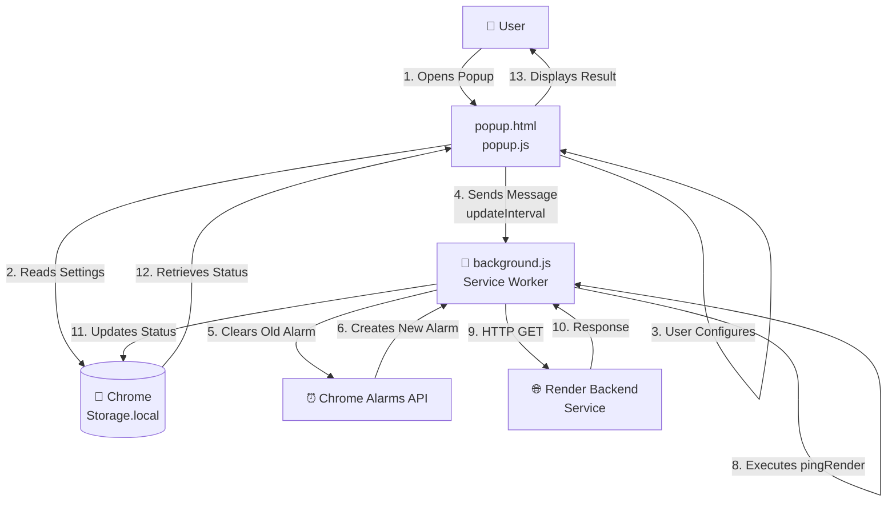

# 🚀 Render Keep Alive Chrome Extension

[](LICENSE) [](manifest.json) [](manifest.json)

## 📋 Table of Contents

-   [Overview](#-overview)
-   [Features](#-features)
-   [Why Render Keep Alive?](#-why-choose-render-keep-alive)
-   [Installation Guide](#-quick-installation-guide)
-   [Usage Instructions](#-how-to-use-it)
-   [Configuration Guide](#-configuration-guide--best-practices)
-   [Development & Architecture](#-development--architecture)
-   [Troubleshooting](#-troubleshooting)
-   [FAQ](#-frequently-asked-questions)
-   [Contributing](#-contributing)
-   [License](#-license)

---

## ✨ Overview

**Render Keep Alive** is your essential companion for eliminating frustrating "cold starts" on your [Render.com](https://render.com/) backend services. This lightweight Chrome extension ensures your applications stay awake and responsive by automatically sending periodic HTTP GET requests to your specified service URL. Say goodbye to delays and hello to instant access! 👋

**Ideal for:** Developers using Render.com's free or hobby tier who need consistent uptime for their applications.

---

## 💡 Features that Shine

-   **⏰ Automatic Periodic Pings:** Set it and forget it! The extension leverages Chrome's alarm API to send HTTP GET requests to your Render backend at your custom intervals.
-   **⚙️ Configurable URL & Interval:** Define your Render service URL and the desired ping interval (1-1440 minutes) directly from an intuitive, user-friendly popup interface.
-   **📊 Real-Time Status Monitoring:** View detailed information about your last ping attempt, including timestamp, status (✅ success, ❌ failed, or ⚠️ error), and HTTP status codes or error messages.
-   **👻 Silent Background Operation:** Once configured, the extension runs discreetly in the background 24/7, ensuring your service remains active even when the popup is closed or your browser is minimized.
-   **🛡️ Robust Error Handling:** Smart error handling for network issues, timeouts (10 second limit), and connection failures, with detailed logging for debugging.
-   **✅ Intelligent URL Validation:** Prevents common mistakes with built-in validation for proper URL formatting (requires `http://` or `https://`).
-   **💾 Persistent Configuration:** Your settings are securely stored in Chrome's local storage and automatically restored on browser restarts.
-   **🔄 Cross-Browser Support:** Works seamlessly with Chrome and Chrome-based browsers (Edge, Brave, etc.).

---

## 🤔 Why Choose Render Keep Alive?

### The Cold Start Problem

Render.com offers an excellent platform, but free-tier and hobby tier services enter an idle state after inactivity to conserve resources. While eco-friendly, this causes **"cold starts"** – frustrating delays when users access your application for the first time after it's been dormant.

### The Solution

**Render Keep Alive** is your simple, *set-and-forget* solution to conquer cold starts:

-   ✅ **Zero Configuration:** Just enter your URL and ping interval
-   ✅ **Always Active:** Your service stays warm and responsive 24/7
-   ✅ **Lightweight:** Minimal resource consumption
-   ✅ **Reliable:** Proven Chrome Manifest V3 API architecture
-   ✅ **Free:** Open-source and no premium features required

**Result:** Your users get instant responses, improved user experience, and no more frustrating loading times!

---

## 🚀 Quick Installation Guide

### Option 1: Git Clone (Recommended for Developers)

```bash
git clone https://github.com/yourusername/render-keepalive-extension.git
cd render-keepalive-extension
```

### Option 2: Download ZIP

Download the [latest release](https://github.com/yourusername/render-keepalive-extension/archive/main.zip) and extract it to a folder on your computer.

### Step-by-Step Installation

1.  **Open Chrome Extensions Page:**
    -   Launch Chrome/Edge/Brave
    -   Type `chrome://extensions` in the address bar and press Enter

2.  **Enable Developer Mode:**
    -   Click the **"Developer mode"** toggle in the top right corner

3.  **Load the Extension:**
    -   Click **"Load unpacked"**
    -   Navigate to and select the `render-keepalive-extension` folder
    -   Click "Select Folder"

4.  **Pin for Easy Access (Optional but Recommended):**
    -   Click the **puzzle piece icon** in your Chrome toolbar
    -   Find "**Render Keep Alive**" and click the **pin icon**
    -   The extension icon will now appear in your toolbar

✅ **Installation complete!** You're ready to configure and start using the extension.

---

## 🎮 How to Use It

### Quick Start (2 Minutes)

1.  **Click the Extension Icon** in your Chrome toolbar to open the popup
2.  **Enter Your Render URL** (e.g., `https://my-app.onrender.com/health`)
3.  **Set Ping Interval** (default: 5 minutes)
4.  **Click "Save Settings"**
5.  **Done!** Check the "Last Ping" status to verify it's working

### Step-by-Step Walkthrough

#### Step 1: Open the Extension

Click on the Render Keep Alive icon in your Chrome toolbar to bring up the popup window.

#### Step 2: Enter Your Render URL

In the **"🌐 Render URL"** field, paste the full URL of your Render backend service:

```
https://my-awesome-app.onrender.com/health
```

**Important Tips:**
-   ⭐ Always include the protocol (`http://` or `https://`)
-   ⭐ Use a **dedicated health check endpoint** if possible (e.g., `/health`, `/ping`, `/status`)
-   ⭐ Avoid URLs with query parameters; keep it simple
-   ⭐ The URL must be publicly accessible

#### Step 3: Configure Ping Interval

In the **"⏱️ Ping Interval (minutes)"** field, enter your desired interval:

-   **Minimum:** 1 minute (very frequent, high resource usage)
-   **Default:** 5 minutes (recommended)
-   **Maximum:** 1440 minutes (24 hours)

**Recommendations:**
-   **5-10 minutes:** Ideal for most use cases (prevents cold starts)
-   **15-30 minutes:** Balanced for lower resource consumption
-   **1-2 minutes:** Only if absolutely necessary (may trigger rate limits)

#### Step 4: Save Settings

Click the **"💾 Save Settings"** button to apply your configuration.

You'll see a confirmation message: `✅ Settings saved! Pinging every X minute(s)`

#### Step 5: Monitor Status

The **"Last Ping"** section shows:

-   **Status:** ✅ Success, ❌ Failed, or ⚠️ Error
-   **HTTP Status Code:** (e.g., 200, 500)
-   **Timestamp:** Date and time of the last ping

---

## ⚙️ Configuration Guide & Best Practices

### Recommended Settings by Use Case

| Use Case | URL Example | Interval | Notes |
|----------|-------------|----------|-------|
| **Production API** | `https://api.onrender.com/health` | 5-10 min | Standard recommendation |
| **Web App** | `https://myapp.onrender.com/` | 5-10 min | Root path or health endpoint |
| **Background Job** | `https://worker.onrender.com/ping` | 15-30 min | Less critical, lower frequency |
| **Development/Testing** | `https://dev.onrender.com/test` | 30-60 min | For testing only |

### Best Practices

✅ **DO:**
-   Use a dedicated health check endpoint (`/health`, `/ping`, `/status`)
-   Test your URL in a browser first to ensure it's accessible
-   Choose an interval that prevents cold starts without wasting resources
-   Monitor the "Last Ping" status regularly
-   Keep your Render URL accessible (no authentication required)

❌ **DON'T:**
-   Use URLs with query parameters or fragments
-   Set the interval too low (1 minute) unless absolutely necessary
-   Point to endpoints that perform heavy operations
-   Use private/internal URLs that aren't publicly accessible
-   Forget to verify the URL works before saving

### Tips for Optimal Performance

-   **Use a Fast Endpoint:** The faster your health check endpoint responds, the better
-   **Return Minimal Data:** Health endpoints should return just a simple status (e.g., `{"status":"ok"}`)
-   **Avoid State Changes:** Don't use this for endpoints that modify data
-   **Monitor Resource Usage:** Ensure the pings don't negatively impact your Render quota

---

## 👨‍💻 Development & Architecture

### 🛠️ Technology Stack

-   **HTML5:** Semantic markup for the intuitive popup interface
-   **CSS3:** Modern styling with gradients, animations, and responsive design
-   **Vanilla JavaScript:** Pure JS, no frameworks – lightweight and performant
-   **Chrome Manifest V3:** Latest extension standard with enhanced security

### 📂 Project Architecture & Data Flow



### 📁 File Structure

```
render-keepalive-extension/
├── manifest.json           # Extension metadata & permissions
├── background.js           # Service worker (background logic)
├── popup.html             # UI markup
├── popup.js               # UI interactivity & storage
├── icons/                 # Extension icons
├── LICENSE                # MIT License
└── README.md              # This file
```

### 🔑 Key Components

#### `manifest.json`
Defines the extension's identity, permissions, and entry points:
- Uses Manifest V3 for enhanced security
- Requires `storage` permission (for saving settings)
- Requires `alarms` permission (for periodic pings)
- Specifies background service worker

#### `background.js` - The Brain 🧠
Manages the core functionality:
- **On Install:** Creates initial alarm with default 5-minute interval
- **On Startup:** Recreates alarm to survive browser restarts
- **On Alarm:** Triggers the `pingRender()` function
- **pingRender():** Fetches the configured URL with 10-second timeout and error handling
- **Storage:** Logs last ping status, timestamp, and HTTP status codes

#### `popup.html` & `popup.js` - The Interface 🎨
Provides user-friendly UI:
- URL input with validation
- Interval configuration (1-1440 minutes)
- Real-time status display with visual indicators
- Responsive design with smooth animations

### 🔄 How It Works

1. User opens the popup and enters a Render URL and ping interval
2. Extension saves settings to Chrome's local storage
3. Extension tells background service worker to update the alarm
4. Background worker creates a recurring alarm at the specified interval
5. Every X minutes, the alarm triggers `pingRender()`
6. `pingRender()` fetches the URL with a 10-second timeout
7. Success/failure status is stored in local storage
8. Next time popup opens, it displays the last ping status

---

## 🔧 Troubleshooting

### Issue: Extension doesn't appear in toolbar

**Solution:**
1. Go to `chrome://extensions`
2. Find "Render Keep Alive"
3. Click the pin icon to make it visible in the toolbar

### Issue: Getting "❌ Invalid URL format" error

**Cause:** URL doesn't start with `http://` or `https://`

**Solution:**
```
❌ my-app.onrender.com
✅ https://my-app.onrender.com
✅ https://my-app.onrender.com/health
```

### Issue: Last Ping shows "Error (Timeout)"

**Cause:** Your endpoint takes more than 10 seconds to respond

**Solution:**
- Verify your Render service is running and responding quickly
- Use a faster health check endpoint
- Check your Render logs for errors
- Ensure the URL is publicly accessible

### Issue: Settings not saving

**Cause:** Browser storage might be blocked or corrupted

**Solution:**
1. Go to `chrome://settings/siteDetails?site=chrome-extension://[EXTENSION_ID]`
2. Ensure "Cookies and site data" is set to "Allow"
3. Try clearing extension data and re-saving

### Issue: Pings aren't happening in the background

**Cause:** Service worker might have been suspended

**Solution:**
1. Go to `chrome://extensions` and reload the extension
2. Check Chrome's system is not in extreme power saving mode
3. Verify the URL is still valid and accessible

### Issue: Ping shows "failed" with error code

**Cause:** Your Render service might be down or returning an error

**Solution:**
1. Test the URL directly in your browser
2. Check Render.com dashboard for service status
3. Verify your endpoint exists and returns a successful response
4. Check server logs for issues

### Enable Debug Logging

To see detailed logs from the extension:
1. Go to `chrome://extensions`
2. Find "Render Keep Alive"
3. Click "Inspect views" → "background.js"
4. Check the Console tab for ping logs

---

## ❓ Frequently Asked Questions

### Q: Does this work with services other than Render.com?

**A:** Yes! The extension works with any publicly accessible URL. You can use it with Heroku, Railway, AWS, Azure, or any service you want to keep alive with periodic pings.

### Q: What if my service URL requires authentication?

**A:** Currently, the extension sends simple GET requests without authentication. For protected endpoints:
- Use an unauthenticated health check endpoint
- Whitelist the extension's IP (if your service supports it)
- Consider a public status endpoint without auth requirements

### Q: Can I ping multiple services?

**A:** Currently, the extension supports one URL at a time. To monitor multiple services, install multiple instances or use the extension multiple times with different profiles.

### Q: Will this use up my Render bandwidth quota?

**A:** Minimally. A simple HTTP GET request uses very little data (typically <1KB per ping). At 5-minute intervals, that's ~288 requests/day ≈ 288KB/day.

### Q: What happens if I close my browser?

**A:** The extension persists and continues running when you restart your browser. Chrome service workers are designed to be long-lived even when the browser is closed.

### Q: Is there a maximum or minimum ping interval?

**A:** 
- **Minimum:** 1 minute (not recommended, high resource usage)
- **Maximum:** 1440 minutes (24 hours)
- **Recommended:** 5-10 minutes

### Q: Does this extension collect any data?

**A:** No. All data (URL, interval, ping status) is stored locally in your browser. We don't collect, transmit, or analyze any user data.

### Q: Is there a privacy policy?

**A:** This extension is entirely local-based. It doesn't communicate with any servers except the Render URL you configure. Your data never leaves your browser.

### Q: Can I use this on mobile?

**A:** Chrome extensions are not available on mobile browsers. Desktop/laptop Chrome only.

### Q: Will this work on Chrome on MacOS/Linux/Windows?

**A:** Yes! The extension works on Chrome on all major operating systems (Windows, macOS, Linux).

---

## 🤝 Contributing

We welcome contributions! If you'd like to improve this extension:

1. Fork the repository
2. Create a feature branch (`git checkout -b feature/amazing-feature`)
3. Make your changes
4. Commit your changes (`git commit -m 'Add amazing feature'`)
5. Push to the branch (`git push origin feature/amazing-feature`)
6. Open a Pull Request

### Areas for Contribution

-   🐛 **Bug fixes:** Report issues and submit fixes
-   ✨ **Features:** Multiple URL support, advanced scheduling, UI improvements
-   📝 **Documentation:** Improve guides and examples
-   🎨 **Design:** UI/UX enhancements
-   🌍 **Localization:** Multi-language support

### Development Workflow

1. Load the extension in development mode (`chrome://extensions` → Load unpacked)
2. Make changes to the source files
3. Reload the extension to test changes
4. Check the console for any errors or logs

---

## 📄 License

This project is licensed under the **MIT License** – see the [LICENSE](LICENSE) file for details.

**Copyright © 2026 Chirabrata Ghosal**

---

## 🙏 Support

If you find this extension helpful, please:

-   ⭐ **Star this repository** on GitHub
-   📤 **Share it** with other developers
-   💬 **Report issues** with detailed information
-   ✅ **Contribute** improvements and fixes

---

## 📞 Contact & Support

-   **Issues:** Open a GitHub issue with detailed information
-   **Suggestions:** Submit feature requests or improvements
-   **Documentation:** Check this README and inline code comments

---

**Happy coding! May your Render backends never sleep again! 🚀**
-   `popup.js`: The interactive logic for the popup, handling user inputs, saving settings to Chrome storage, validating URLs, and dynamically displaying the ping status.
-   `icon.svg`: The crisp, scalable vector icon for the extension, ensuring a polished look across all resolutions.
-   `icons/`: A dedicated directory containing various sized icons, including a generated image for potential future use (`Gemini_Generated_Image_7ocj0s7ocj0s7ocj.png`).
-   `LICENSE`: The legal document outlining the licensing terms for this project.

## 🤝 Contributing

(If this were an open-source project, this section would detail how fellow developers could contribute, e.g., forking, creating branches, and submitting pull requests. Your contributions are welcome!)

## 📜 License

This project is proudly licensed under the **[MIT License](LICENSE)**. For comprehensive details, please refer to the `LICENSE` file within this repository.

## 🙏 Acknowledgements

-   Deeply inspired by the ongoing need to keep Render.com services vibrant and responsive.

---

**⚠️ Important Note:** This extension is crafted for personal use and is specifically designed to alleviate cold starts on free-tier services. **Always ensure that your usage aligns with Render.com's official terms of service.**
